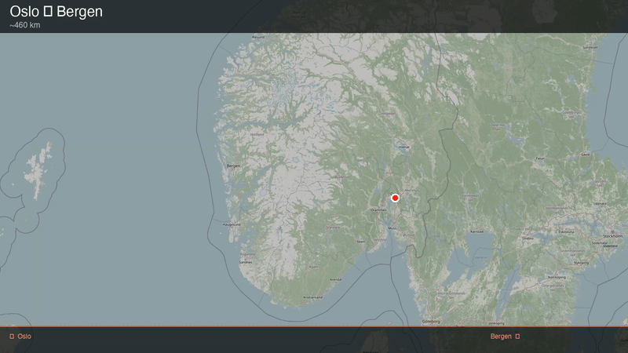

# travel-map-animator

Render a Jet Lag-style animated travel route MP4 from coordinate pairs — no account, no watermark, fully local.



---

## What it does

`travel-map-animator` progressively reveals a travel route over a desaturated OpenStreetMap basemap,
frame by frame, with Jet Lag: The Game-style dark overlay bars showing the trip title and endpoints.
All frames are drawn locally with PIL after a single tile download pass, and the result is assembled
into a 1920×1080 MP4 by ffmpeg.

---

## Why this exists

`travel-map-animator` is the only open-source CLI tool *we could find* that renders a complete
animated travel-route MP4 — including real rail geometry fetched directly from OpenStreetMap,
with no account, no watermark, and no GUI — running fully locally on a single Python file with ffmpeg.
See [`docs/competitive-notes.md`](docs/competitive-notes.md) for a detailed comparison of
alternatives found during research.

---

## Install

**Python dependencies:**

```bash
python3 -m venv .venv
source .venv/bin/activate
pip install -r requirements.txt
```

Python 3.10 or newer is required.

**ffmpeg:**

```bash
brew install ffmpeg      # macOS (Homebrew)
apt install ffmpeg       # Debian / Ubuntu
```

---

## Usage

### CLI arguments

| Argument          | Required | Default   | Description |
|-------------------|----------|-----------|-------------|
| `--start`         | yes      | —         | Start point as `"lon,lat,Place name"` |
| `--end`           | yes      | —         | End point as `"lon,lat,Place name"` |
| `--stops`         | no       | none      | Zero or more intermediate stops as `"lon,lat,Name"` |
| `--title`         | yes      | —         | Large text displayed at the top of every frame |
| `--subtitle`      | no       | `""`      | Smaller text displayed below the title |
| `--output`        | yes      | —         | Output file path (must end in `.mp4`) |
| `--zoom`          | no       | `7`       | OpenStreetMap zoom level (6 = continent, 11 = city) |
| `--fps`           | no       | `30`      | Frames per second |
| `--duration`      | no       | `4.0`     | Seconds spent drawing the route |
| `--hold`          | no       | `1.5`     | Extra seconds held on the finished map |
| `--mode`          | no       | `driving` | `driving`, `walking`, or `rail` |
| `--osm-relation`  | no       | none      | OSM relation ID for a named rail line (only with `--mode rail`) |
| `--width`         | no       | `1920`    | Output video width in pixels |
| `--height`        | no       | `1080`    | Output video height in pixels |

### Example script

```bash
bash examples/oslo-bergen.sh
```

Or call the script directly:

```bash
python3 make_map_animation.py \
  --start "10.7531,59.9110,Oslo" \
  --end   "5.3242,60.3929,Bergen" \
  --title "Oslo - Bergen" --subtitle "~460 km" \
  --mode driving --zoom 7 \
  --output oslo_bergen.mp4
```

---

## Modes

### `driving` and `walking`

Route geometry is fetched from the [public OSRM demo server](http://router.project-osrm.org).
`driving` follows roads suitable for cars and buses; `walking` follows pedestrian paths.

### `rail`

Rail geometry is fetched from OpenStreetMap via the [Overpass API](https://overpass-api.de).
The script downloads the actual `railway=rail` ways in the bounding box and stitches them into
a continuous route using a greedy nearest-neighbour algorithm.

**Recommended:** pass `--osm-relation <ID>` to restrict the query to a single named rail line
(e.g. a relation that represents Dovrebanen). Without it, every rail way in the bounding box is
included, which can look tangled in dense rail areas like city centres.

Finding a relation ID: search for the line name on [openstreetmap.org](https://www.openstreetmap.org),
click the "Relation" result, and read the number from the URL — e.g. `relation/965964` gives ID `965964`
(Dovrebanen, Oslo S → Trondheim).

Example — Oslo S → Lillehammer via Dovrebanen:

```bash
python3 make_map_animation.py \
  --start "10.7531,59.9110,Oslo S" \
  --end   "10.4647,61.1153,Lillehammer" \
  --title "Dovrebanen // Oslo S - Lillehammer" \
  --subtitle "~183 km" \
  --output dovrebanen.mp4 \
  --zoom 8 --duration 5 --hold 2 \
  --mode rail --osm-relation 965964
```

If the Overpass API fails (all three mirror endpoints), the script automatically falls back to
OSRM driving geometry and prints a warning.

---

## Use as a Claude Code skill

Copy the `skill/` directory into your Claude Code skills folder:

```bash
cp -r skill/ ~/.claude/skills/map-animation/
```

Claude will then recognize requests like "animate this route" or "draw the route on a map"
and invoke the skill, which calls `make_map_animation.py` with the correct arguments.

---

## Limitations

- **Public OSRM and Overpass servers are best-effort.** They are free, rate-limited community
  resources and can be slow or unavailable. They are not suitable for bulk or automated use.
  Please respect the respective usage policies.
- **OSM tile usage policy.** Map tiles are fetched once per render with an identifying
  `User-Agent` header. Please read the
  [OSM tile usage policy](https://operations.osmfoundation.org/policies/tiles/) before
  heavy use.
- **Rail mode without `--osm-relation`** can produce tangled routes in areas with dense
  rail networks (junctions, metro lines, freight sidings). Use `--osm-relation` for clean
  single-line results.
- **Fonts.** The script tries macOS system fonts (Helvetica, Arial) first, then Linux fonts
  (DejaVu), then PIL's built-in fallback. Rendering may look slightly different across platforms.
- **Title/subtitle text is rendered with system fonts via PIL — non-ASCII symbols (e.g. `→`) may
  render as boxes depending on the available font. Stick to plain text for titles.**
- **Video encoding.** On Apple Silicon, hardware H.264 encoding (`h264_videotoolbox`) is used
  automatically. On other hardware, the script falls back to `libx264` (software encoding, slower
  but universally available wherever ffmpeg is installed).

---

## License

MIT — see [LICENSE](LICENSE).
